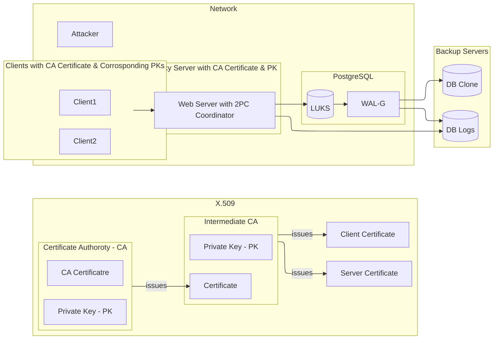

# Defense-in-Depth: System Design

The following diagram represents the overall workings of the database system that is able to handle various threats that are stated in the threat model.

```mermaid
---
config:
  layout: elk
  elk:
    nodePlacementStrategy: LINEAR_SEGMENTS
---
flowchart LR
    subgraph X [X.509]
        subgraph C [Certificate Authoroty - CA]
            CA[CA Certificatre]
            PK[Private Key - PK]
        end
        subgraph I [Intermediate CA]
            ICA[Certificate]
            IPK[Private Key - PK]
        end
        
        CC[Client Certificate]
        SC[Server Certificate]
        C --issues--> ICA
        I --issues--> CC
        I --issues--> SC
        
    end
    subgraph Network
        At[Attacker]

        subgraph Clients [Clients with CA Certificate & Corrosponding PKs]
            A[Client1]
            B[Client2]
        end
        
        subgraph Server [ Proxy Server  with CA Certificate & PK]
            App[Web Server with 2PC Coordinator]
        end

        subgraph DB [PostgreSQL]
            LKS@{ shape: cyl, label: "LUKS"}
            WAL[WAL-G]
        end
        Clients --> App
        App --> LKS
    end
    subgraph DBB [Backup Servers]
        BKP@{ shape: cyl, label: "DB Clone"}
        LOG@{ shape: cyl, label: "DB Logs"}
        WAL[WAL-G]
    end
    App --> LOG
    WAL --> BKP
    WAL --> LOG
    LKS --> WAL    
```