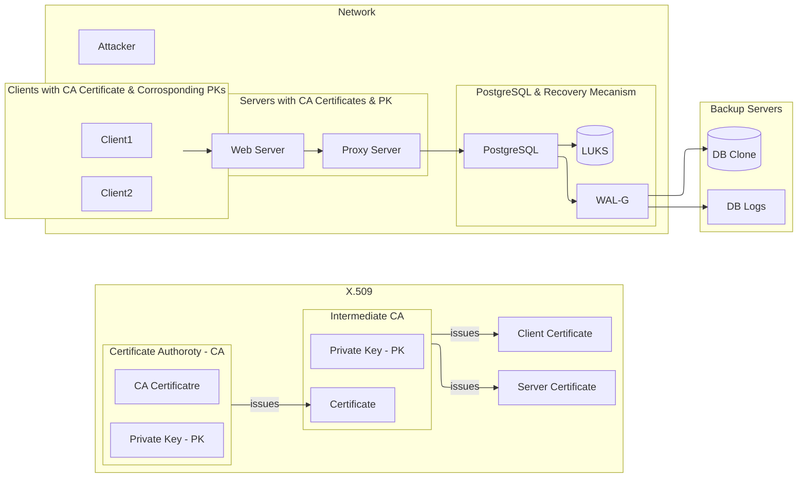

# Defense-in-Depth: System Design

The following diagram represents the overall workings of the database system that is able to handle various threats that are stated in the threat model.

- Use proxy server/s (HAProxy | PgBouncer | ProxySQL ) to perfrm security checks and handle DOS attacks.
- Set statement_timeout on db server which aborts any statement that takes more than the specified time.
- Use WAL-G for maintaining Physical Backups and Point-in-Time Recovery (PITR)
- Use Network File System (NFS), a folder that lives on a different server but is mounted so it looks like a local folder on the DB server, to store database logs.
